# Tiling the Plane

This project contains various svg tessellations (or tilings) implemented in Elm

Website deployed [here](https://vsebastian8.github.io/Tessellation/)

Inspiration: [The Sacred Geometry of Tilings](https://www.youtube.com/watch?v=wiWEP5Kf8sk&t=398s)

## Regular Tilings

|                                                      |                                                         |                                                       |
| :--------------------------------------------------: | :-----------------------------------------------------: | :---------------------------------------------------: |
|  | 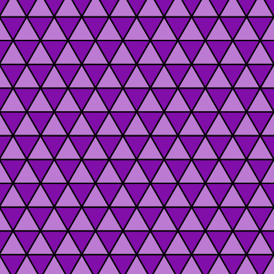 |  |
|                       _Square_                       |                      _Triangular_                       |                      _Hexagonal_                      |

## Semiregular Tilings

|                                                                     |                                                                         |                                                                      |
| :-----------------------------------------------------------------: | :---------------------------------------------------------------------: | :------------------------------------------------------------------: |
|  |      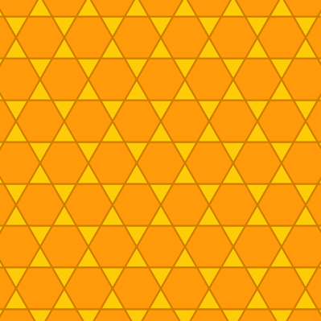      |   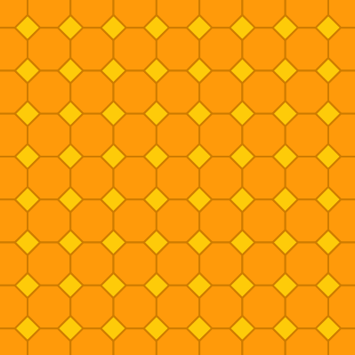   |
|                        _Truncated Hexagonal_                        |                             _Trihexagonal_                              |                          _Truncated Square_                          |
| 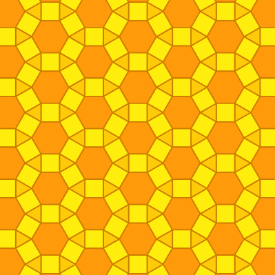 | 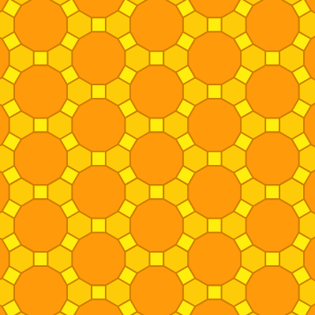  |     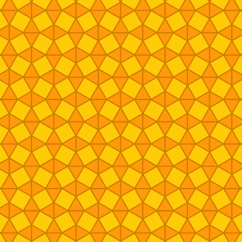      |
|                        _Rhombitrihexagonal_                         |                        _Truncated Trihexagonal_                         |                            _Snub Square_                             |
|  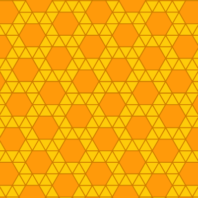  |  | 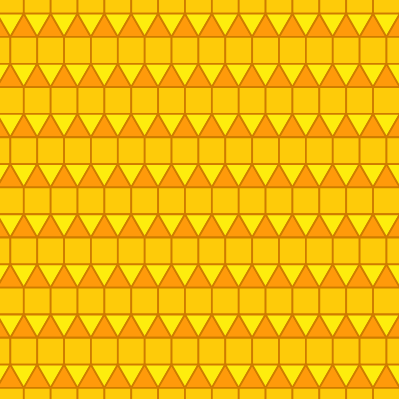 |
|                         _Snub Trihexagonal_                         |                      _Mirrored Snub Trihexagonal_                       |                        _Elongated Triangular_                        |

## Laves Tilings

|                                                              |                                                                  |                                                             |
| :----------------------------------------------------------: | :--------------------------------------------------------------: | :---------------------------------------------------------: |
| 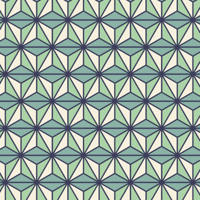 |       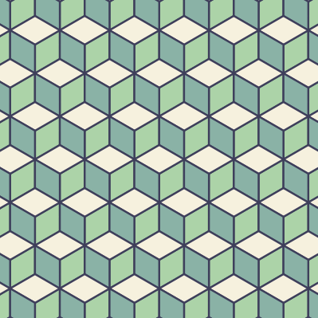        |  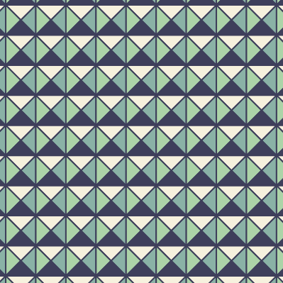  |
|                     _Triakis Triangular_                     |                            _Rhombile_                            |                      _Tetrakis Square_                      |
| 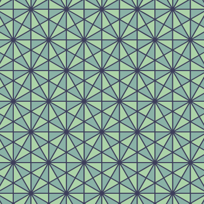 | 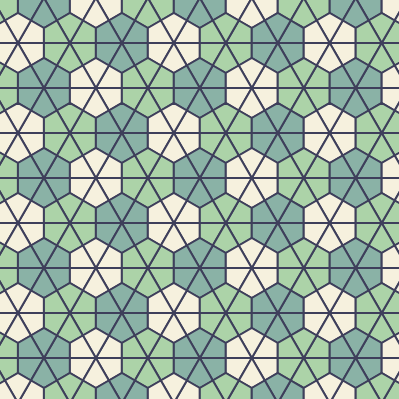 | 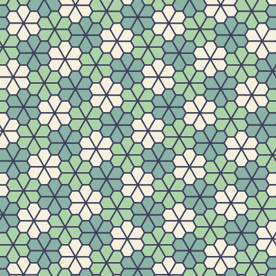 |
|                     _Disdyakis Rhombile_                     |                     _Deltoidal Trihexagonal_                     |                     _Floret Pentagonal_                     |
|  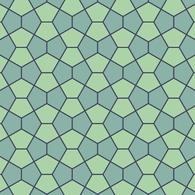  |  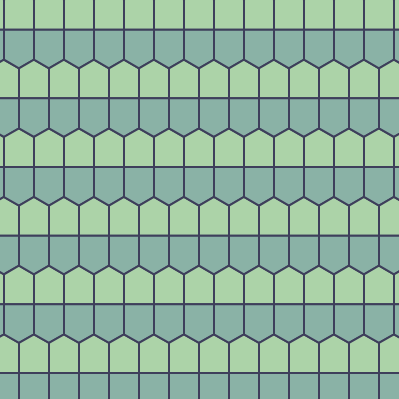  |
|                      _Cairo Pentagonal_                      |                      _Prismatic Pentagonal_                      |

## Experiments

|                                                                    |                                                                    |                                                                  |
| :----------------------------------------------------------------: | :----------------------------------------------------------------: | :--------------------------------------------------------------: |
|       |    |  |
|                          _Blocky Pattern_                          |                         _Diagonal Pattern_                         |                        _Vertical Pattern_                        |
| 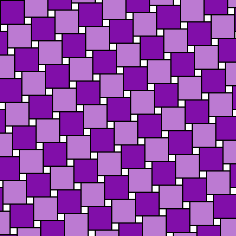 |  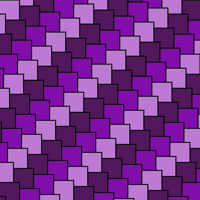   | 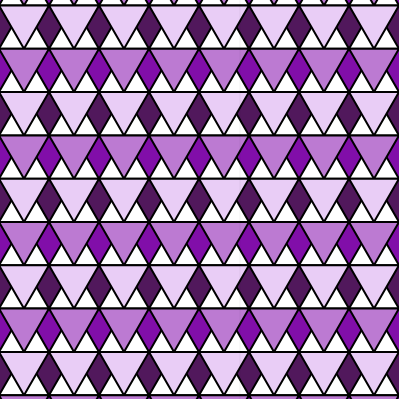 |
|                        _Pythagorean Tiling_                        |                         _Hugging Squares_                          |                      _Triangles and Rhombi_                      |
|   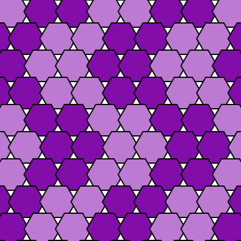    | 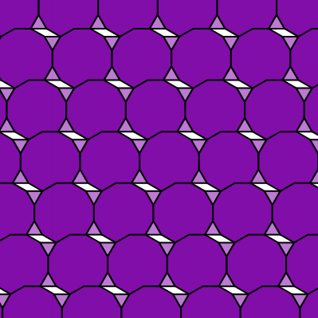 |  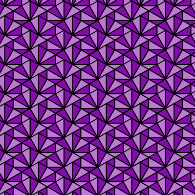  |
|                          _Hexagon Stars_                           |                        _Shifted Dodecagons_                        |                         _Disdyakis Mess_                         |
|  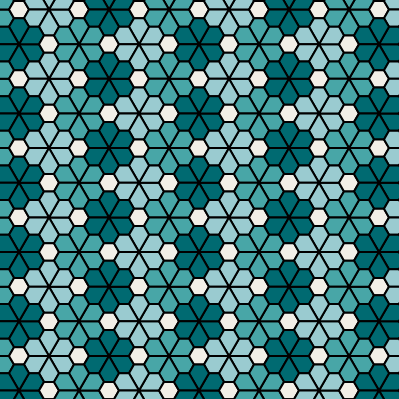  | 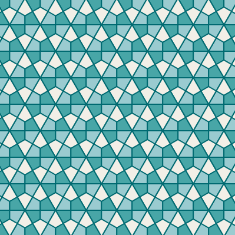  |  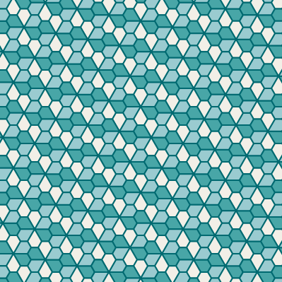  |
|                         _Floret Hexagonal_                         |                        _Deltoidal Pattern_                         |                         _Floret Pattern_                         |
