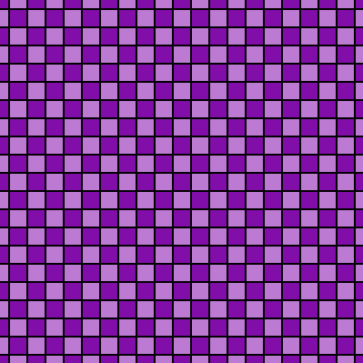
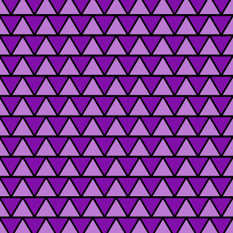
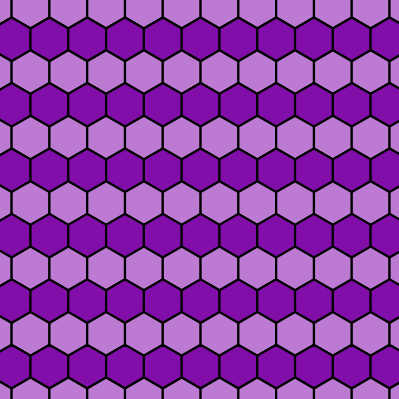
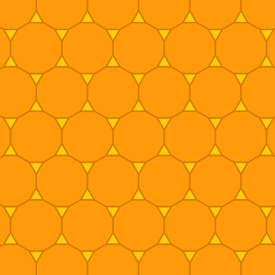
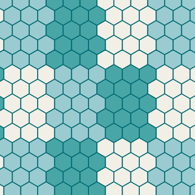
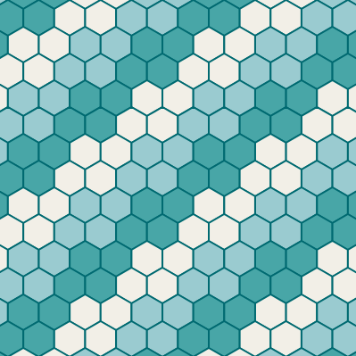
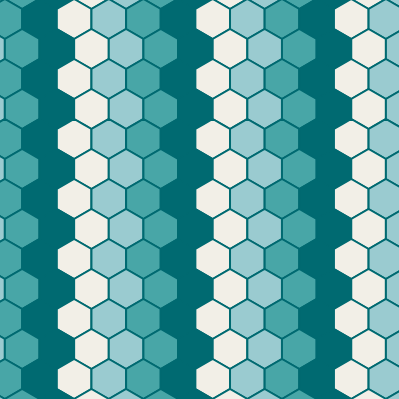
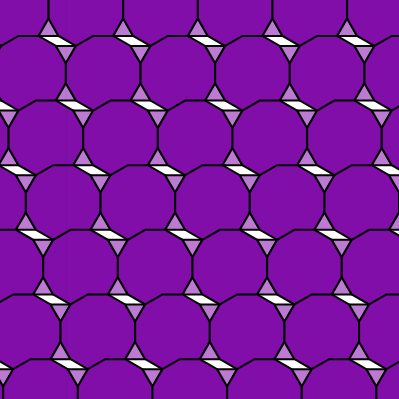

# Tiling the Plane

## Regular Tilings

|  |
| :--------------------------------------------: |
|                _Square Tiling_                 |

|  |
| :------------------------------------------------: |
|                 _Triangle Tiling_                  |

|  |
| :----------------------------------------------: |
|                 _Hexagon Tiling_                 |

## Semiregular Tilings

|  |
| :------------------------------------------------------------------------: |
|                        _Truncated Hexagonal Tiling_                        |

## Experiments

|  |  |  |
| :---------------------------------------------------------------: | :--------------------------------------------------------------------: | :--------------------------------------------------------------------: |
|                                                                   |                       _Different Color Patterns_                       |                                                                        |

|           |
| :------------------------------------------------------------------------: |
| _Accidental Aperiodic Tiling when creating the Truncated Hexagonal Tiling_ |
